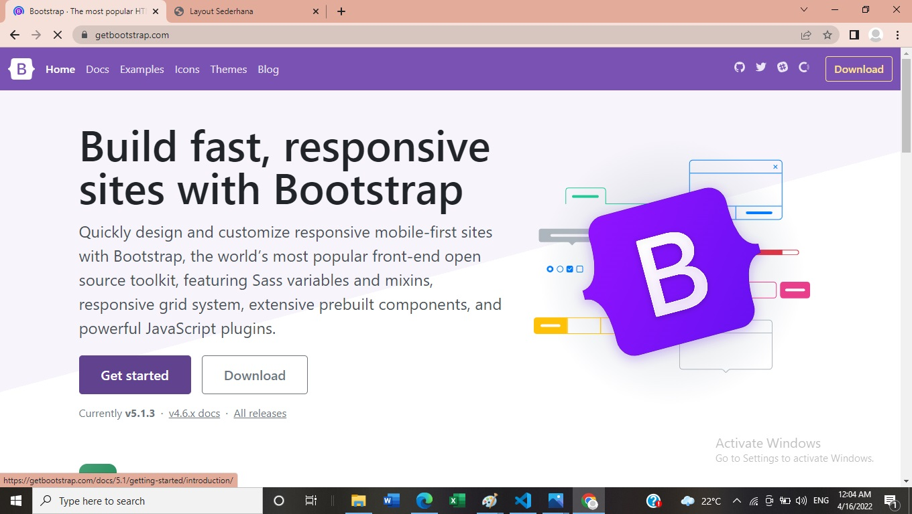
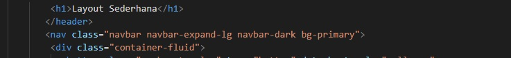

# Lab6Web.
Bootstrap

###### Nama : Fara Deviana
###### NIM : 312010407
###### Kelas : TI.A.2

## Tugas Layout WebProgramming

Praktikum 6: Web Framework
Tujuan
1. Mahasiswa mampu memahami konsep dasar dari web framework.
2. Mahasiswa mampu memahami struktur dasar layout web menggunakan css framework.
3. Mahasiswa mampu memahami elemen-elemen css framewordk
Instruksi Praktikum
1. Persiapkan text editor misalnya VSCode.
2. Buat folder baru dengan nama lab6_css_framework
3. Buat file baru dokumen html
4. Buat struktur dasar dari dokumen HTML.
5. Buatlah layout web sederhana menggunakan css frameword (Twitter Bootsrtap).
6. Lakukan validasi dokumen html dengan mengakses http://validator.w3.org
Berdasarkan gambar layout web berikut, buatlah menggunakan Twitter Bootstrap

###### Membuat statertamplate HTML

 ###### Membuka BOOTSTRAP
 

###### Mengcopy Bootstrap CSS

Visual studio code

buat kerangka layout dengan semantics element seperti berikut.

###### Mengcopy Navbar Sourcecode pada Bootstrap

Hasil

Menambah style CSS

Hasil

###### Mengubah Warna Navbar

menjadi

